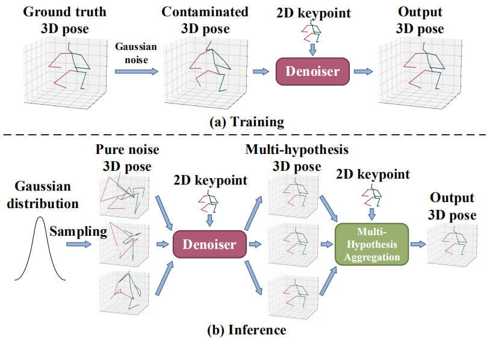

# Diffusion-Based 3D Human Pose Estimation with Multi-Hypothesis Aggregation [ICCV2023]

The PyTorch implementation for ["Diffusion-Based 3D Human Pose Estimation with Multi-Hypothesis Aggregation"](https://arxiv.org/pdf/2303.11579.pdf) .
<p align="center"></p>
<p align="center"></p>


## Dependencies

Make sure you have the following dependencies installed (python):

* pytorch >= 0.4.0
* matplotlib=3.1.0
* einops
* timm
* tensorboard

You should download [MATLAB](https://www.mathworks.com/products/matlab-online.html) if you want to evaluate our model on MPI-INF-3DHP dataset.

## Datasets

Our model is evaluated on [Human3.6M](http://vision.imar.ro/human3.6m) and [MPI-INF-3DHP](https://vcai.mpi-inf.mpg.de/3dhp-dataset/) datasets. 

### Human3.6M

We set up the Human3.6M dataset in the same way as [VideoPose3D](https://github.com/facebookresearch/VideoPose3D/blob/master/DATASETS.md).  You can download the processed data from [here](https://drive.google.com/file/d/1FMgAf_I04GlweHMfgUKzB0CMwglxuwPe/view?usp=sharing).  `data_2d_h36m_gt.npz` is the ground truth of 2D keypoints. `data_2d_h36m_cpn_ft_h36m_dbb.npz` is the 2D keypoints obatined by [CPN](https://github.com/GengDavid/pytorch-cpn).  `data_3d_h36m.npz` is the ground truth of 3D human joints. Put them in the `./data` directory.

### MPI-INF-3DHP

We set up the MPI-INF-3DHP dataset following [P-STMO](https://github.com/paTRICK-swk/P-STMO). However, our training/testing data is different from theirs. They train and evaluate on 3D poses scaled to the height of the universal skeleton used by Human3.6M (officially called "univ_annot3"), while we use the ground truth 3D poses (officially called "annot3"). The former does not guarantee that the reprojection (used by the proposed JPMA) of the rescaled 3D poses is consistent with the 2D inputs, while the latter does. You can download our processed data from [here](https://drive.google.com/file/d/1zOM_CvLr4Ngv6Cupz1H-tt1A6bQPd_yg/view?usp=share_link). Put them in the `./data` directory. 

## Evaluating our models
You can download our pre-trained models, which are evaluated on Human3.6M (from [here](https://drive.google.com/file/d/1c48a2SxIkRxxqP5F1l3kpUSRWwHknYVK/view?usp=sharing)) and MPI-INF-3DHP (from [here](https://drive.google.com/file/d/1x78KEmAXJINPzJJbp7KP9RRjVZI5k-mt/view?usp=sharing)). Put them in the `./checkpoint` directory. 

### Human3.6M

To evaluate our D3DP with JPMA using the 2D keypoints obtained by CPN as inputs, please run:
```bash
python main.py -k cpn_ft_h36m_dbb -c checkpoint -gpu 0 --nolog --evaluate h36m_best_epoch.bin -num_proposals 5 -sampling_timesteps 5 -b 4
```

You can balance efficiency and accuracy by adjusting `-num_proposals` (number of hypotheses) and `-sampling_timesteps` (number of iterations).

For visualization, please run:
```bash
python main_draw.py -k cpn_ft_h36m_dbb -b 2 -c checkpoint -gpu 0 --nolog --evaluate h36m_best_epoch.bin -num_proposals 5 -sampling_timesteps 5 --render --viz-subject S11 --viz-action SittingDown --viz-camera 1
```
The results will be saved in `./plot/h36m`.

### MPI-INF-3DHP
To evaluate our D3DP with JPMA using the ground truth 2D poses as inputs, please run:
```bash
python main_3dhp.py -c checkpoint -gpu 0 --nolog --evaluate 3dhp_best_epoch.bin -num_proposals 5 -sampling_timesteps 5 -b 4
```
After that, the predicted 3D poses under P-Best, P-Agg, J-Best, J-Agg settings are saved as four files (`.mat`) in `./checkpoint`. To get the MPJPE, AUC, PCK metrics, you can evaluate the predictions by running a Matlab script `./3dhp_test/test_util/mpii_test_predictions_ori_py.m` (you can change 'aggregation_mode' in line 29 to get results under different settings). Then, the evaluation results are saved in `./3dhp_test/test_util/mpii_3dhp_evaluation_sequencewise_ori_{setting name}_t{iteration index}.csv`. You can manually average the three metrics in these files over six sequences to get the final results. An example is shown in `./3dhp_test/test_util/H20_K10/mpii_3dhp_evaluation_sequencewise_ori_J_Best_t10.csv`.

## Training from scratch
### Human3.6M
To train our model using the 2D keypoints obtained by CPN as inputs, please run:
```bash
python main.py -k cpn_ft_h36m_dbb -c checkpoint/model_h36m -gpu 0 --nolog
```

### MPI-INF-3DHP
To train our model using the ground truth 2D poses as inputs, please run:
```bash
python main_3dhp.py -c checkpoint/model_3dhp -gpu 0 --nolog
```

## Testing on in-the-wild videos
We follow [P-STMO](https://github.com/paTRICK-swk/P-STMO) to test our model on custom videos. You can use an off-the-shelf 2D keypoint detector (such as [AlphaPose](https://github.com/MVIG-SJTU/AlphaPose)) to yield 2D poses from images and use our model to yield 3D poses. The 2D keypoint detectors are trained on [COCO](https://cocodataset.org/#home) dataset, which defines the order of human joints in a different way from Human3.6M. Thus, our model needs to be re-trained to be compatible with the existing 2D detectors. 

To evaluate our pre-trained model on in-the-wild videos, you can download `in_the_wild_best_epoch.bin` from [here](https://drive.google.com/file/d/1S_mu5slB8_CHqkhB6t-NgFpiiWe6viiy/view?usp=sharing).

To train our model from scratch, you should download 2D keypoints of Human3.6M in COCO format from [here](https://drive.google.com/file/d/1xO0Oo1yV3-5eQSIBUyIzelvaAwWpLqM5/view?usp=sharing). Our model take these 2D keypoints as inputs and outputs 3D joint positions in Human3.6M format. Then, you can use the following command to train our model:

```bash
python main_in_the_wild.py -k detectron_pt_coco -c checkpoint/model_in_the_wild -gpu 0 --nolog
```

After that, you can evaluate our models on in-the-wild videos using [video-to-pose3D](https://github.com/zh-plus/video-to-pose3D). Please follow the below instructions.
1. Follow their `README.md` to set up the code.
2. Put the checkpoint `in_the_wild_best_epoch.bin` to the `./checkpoint` folder of their repo.
3. Put `./in_the_wild/videopose_diffusion.py` to the root path of their repo.
4. Put other files in `./in_the_wild` folder to the `./common` folder of their repo.
5. Run `videopose_diffusion.py`!


## Citation
If you find this repo useful, please consider citing our paper:
```
@InProceedings{Shan_2023_ICCV,
    author    = {Shan, Wenkang and Liu, Zhenhua and Zhang, Xinfeng and Wang, Zhao and Han, Kai and Wang, Shanshe and Ma, Siwei and Gao, Wen},
    title     = {Diffusion-Based 3D Human Pose Estimation with Multi-Hypothesis Aggregation},
    booktitle = {Proceedings of the IEEE/CVF International Conference on Computer Vision (ICCV)},
    month     = {October},
    year      = {2023},
    pages     = {14761-14771}
}
```


## Acknowledgement
Our code refers to the following repositories.
* [VideoPose3D](https://github.com/facebookresearch/VideoPose3D)
* [DiffusionDet](https://github.com/ShoufaChen/DiffusionDet)
* [MixSTE](https://github.com/JinluZhang1126/MixSTE)
* [video-to-pose3D](https://github.com/zh-plus/video-to-pose3D)

We thank the authors for releasing their codes.